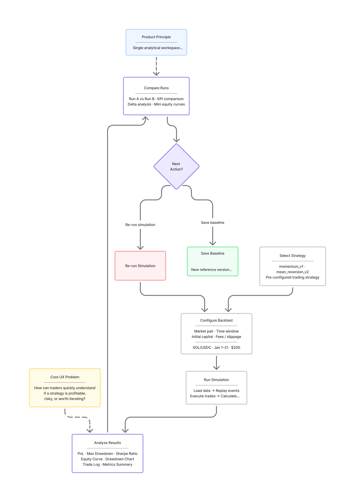
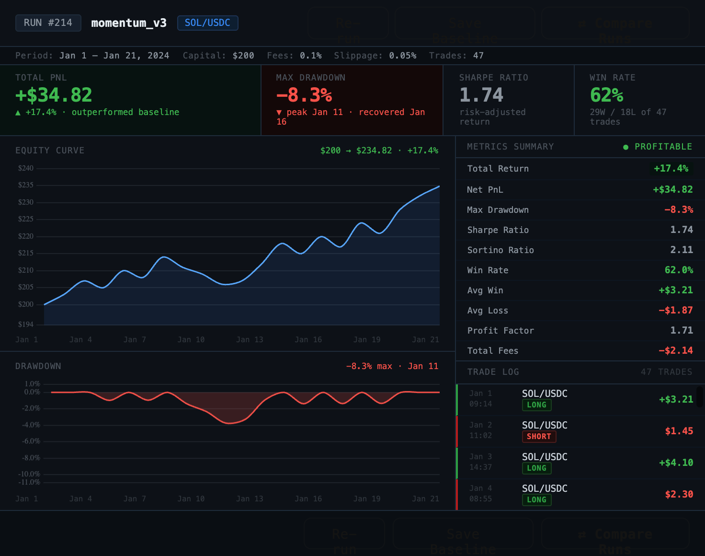

# BacktestLab

Real-time analytical workspace for simulating, evaluating, and comparing Web3 trading strategies.

---

## Product Goal

BacktestLab was designed to reduce the time between strategy idea, simulation, and analytical decision-making.

The platform explores continuous strategy evaluation using:
- historical replay
- real-time market simulation
- iterative performance analysis

The product focuses on helping traders quickly understand:
- profitability
- risk exposure
- drawdown behavior
- performance consistency
- iteration quality

---

## Core UX Problem

Most backtesting tools separate profitability, risk, and iteration into fragmented dashboards.

BacktestLab explores a unified analytical workspace where traders can:
- configure simulations
- monitor execution
- analyze performance
- compare strategy versions
- iterate continuously

inside one persistent workflow.

---

## User Journey

The workflow follows an iterative analytical loop:

Configure → Run Simulation → Analyze Results → Compare Runs → Re-run or Save Baseline

---

## Results Dashboard

BacktestLab explores a compact analytical workspace for evaluating strategy profitability, drawdown behavior, and execution quality inside a single interface.

The MVP focuses on:
- real-time analytical feedback
- continuous strategy iteration
- unified performance analysis
- compact information density inspired by trading terminals

---

## Key Metrics

- PnL
- Max Drawdown
- Sharpe Ratio
- Win Rate
- Profit Factor
- Sortino Ratio

---

## Product Decisions

- Shared timeline between equity curve and drawdown
- Single analytical workspace instead of fragmented dashboards
- Compact information density inspired by trading terminals
- Continuous optimization workflow instead of linear wizard UX
